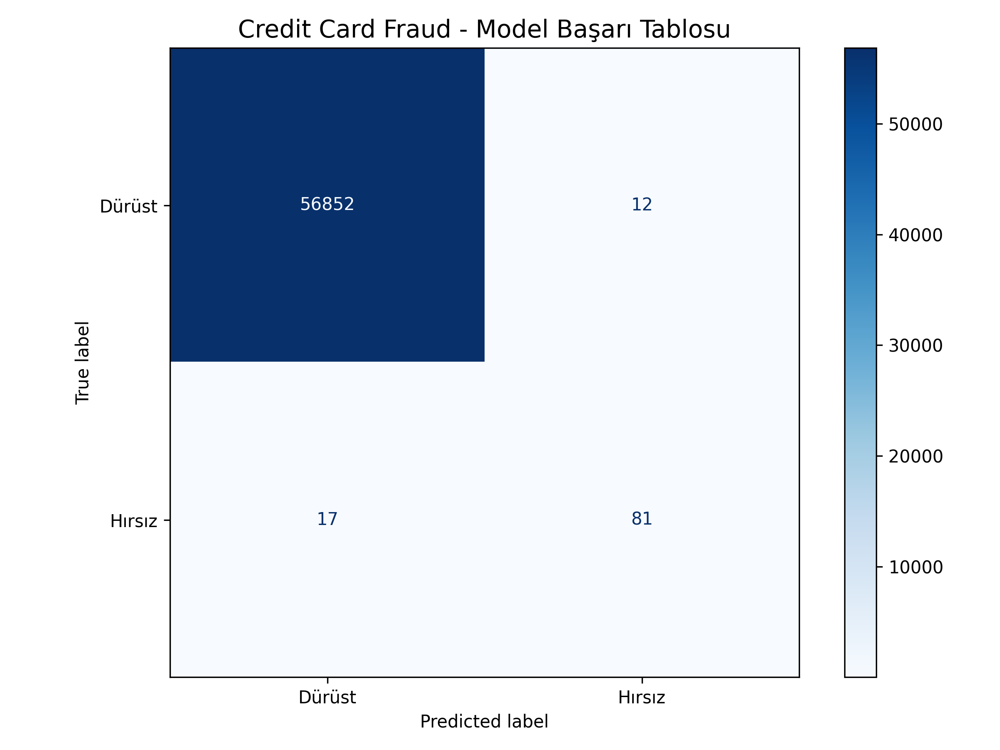

# Credit Card Fraud Detection API

Bu proje, Kaggle üzerindeki "Credit Card Fraud Detection" veri setini kullanarak dolandırıcılık tespiti yapan uçtan uca bir makine öğrenmesi uygulamasıdır. 

Analiz aşamasından başlayıp, modelin her ortamda çalışabilmesi için **FastAPI** ile servis haline getirilmesini ve **Docker** ile konteynerize edilmesini kapsar.

## Proje Bileşenleri
- **Model:** Random Forest Classifier (Dengesiz veri seti SMOTE ile dengelendi)
- **Backend:** FastAPI (Hızlı ve asenkron tahminler için)
- **Deployment:** Docker (Bağımlılık sorunlarını gidermek için)

## Nasıl Çalıştırılır?

Bu projeyi bilgisayarınızda çalıştırmak için Docker yüklü olması yeterlidir:

1. **İmajı Build Etme:**
   ```bash
   docker build -t fraud-api .
2. **Konteyneri Başlatma:**
   docker run -p 8000:8000 fraud-api
3. **Test:**
Tarayıcıdan http://localhost:8000/docs adresine giderek Swagger UI üzerinden tahmin isteği gönderebilirsiniz
## Model Performansı (Confusion Matrix)

Modelin test verileri üzerindeki başarı tablosu aşağıdadır:



**Notlar**
Bu benim ilk MLOps denememdir. Modelin sadece bir notebook üzerinde kalmaması, gerçek bir yazılım ürünü gibi servis edilebilmesi için Docker mimarisini tercih ettim.
